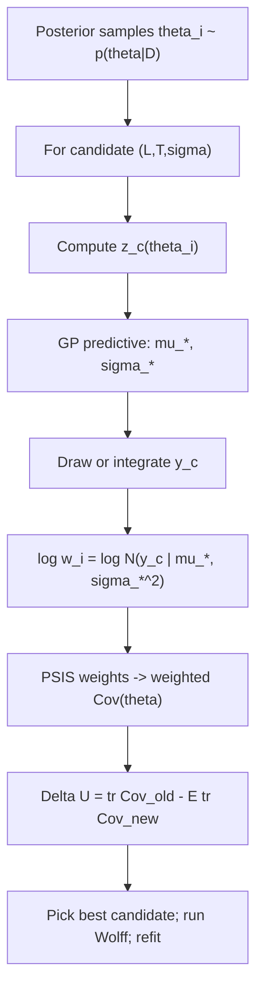

# Active learning: the mathematics

This note explains the maths behind the planned active-learning stage for the
Ising FSS model. The goal is to **rank candidate observations** (e.g. extra Wolff
sweeps at an existing $(L, T)$) **without refitting MCMC** for every candidate.

---

## 1. What we already have

After fitting, we have MCMC samples of the critical exponents

$$
\theta_i = (T_{c,i},\, \nu_i,\, \beta_i), \qquad i = 1,\ldots,N,
$$

drawn from the posterior $p(\theta \mid D)$ given current observables $D$.

The likelihood in [`fss_likelihood.py`](fss_likelihood.py) treats each observable
channel (Binder, $|m|$, etc.) as a **Gaussian-process regression** problem on the
collapsed coordinate

$$
z = t\, L^{1/\nu}, \qquad t = \frac{T - T_c}{T_c}.
$$

For a fixed $\theta$, the universal scaling function in each channel is
**integrated out** analytically, giving a **log marginal likelihood**
$\log p(D \mid \theta)$ that is a sum of GP terms (see
`fss_log_marginal_likelihood_from_arrays`).

So the full posterior is

$$
p(\theta \mid D) \;\propto\; p(\theta)\, p(D \mid \theta),
$$

with uniform priors on the exponents (in the unconstrained reparametrisation used
by JAX inference).

---

## 2. What we want to do

Suppose we are considering a **candidate observation** $c$:

- location: $(L_c, T_c)$ (possibly already in the dataset),
- hypothetical MC outcome: collapsed value $y_c$ with uncertainty $\sigma_c$,
- for “extra sweeps”: $\sigma_c$ is smaller than the current row (more precise).

If we actually measured $y_c$, the **new posterior** would be

$$
p(\theta \mid D, y_c) \;\propto\; p(\theta \mid D)\, p(y_c \mid \theta, D).
$$

The factor $p(y_c \mid \theta, D)$ is the **predictive density** of the new
measurement given the old data and exponent values $\theta$. We want to know how
much this would **shrink uncertainty in $\theta$** — before spending GPU time on
Wolff sweeps.

Naively, we could refit MCMC for every candidate. That is correct but far too
slow. Instead we **reuse the existing samples** $\{\theta_i\}$ with importance
weights.

---

## 3. Importance sampling: updating the posterior for free

Bayes' rule for the updated posterior:

$$
p(\theta \mid D, y_c) \;\propto\; p(\theta \mid D)\, p(y_c \mid \theta, D).
$$

If $\theta_i \sim p(\theta \mid D)$, then weights

$$
w_i(y_c) \;\propto\; p(y_c \mid \theta_i, D)
$$

give a discrete approximation to $p(\theta \mid D, y_c)$:

$$
\mathbb{E}_{p(\theta \mid D, y_c)}[g(\theta)]
\;\approx\;
\frac{\sum_i w_i(y_c)\, g(\theta_i)}{\sum_i w_i(y_c)}.
$$

**Key point:** we never need the normalising constant of the full posterior, only
**ratios** of predictive densities across samples. The prior $p(\theta)$ cancels
because it already appears in both the old posterior and the update.

In log form (numerically stable):

$$
\log w_i(y_c) = \log p(y_c \mid \theta_i, D) + \text{const}.
$$

So the entire “simulate a new observation” step reduces to: **for each posterior
draw $\theta_i$, evaluate the log predictive density of $y_c$**.

---

## 4. Why the log predictive density?

This is the step that often feels mysterious, so we unpack it carefully.

### 4.1 Incremental likelihood

Adding one datapoint changes the total log likelihood by

$$
\Delta \log p(D \cup \{y_c\} \mid \theta)
= \log p(D \cup \{y_c\} \mid \theta) - \log p(D \mid \theta).
$$

For a GP regression model with Gaussian observation noise, this difference is
**exactly** the log predictive density of the new point:

$$
\Delta \log p(y_c \mid \theta, D)
= \log p(y_c \mid \theta, D).
$$

**Why?** Write the GP marginal likelihood as a product of conditionals (chain
rule on the joint over all points). When you append $(x_c, y_c)$:

$$
p(y_{1:n}, y_c \mid f)
= p(y_{1:n} \mid f)\, p(y_c \mid y_{1:n}, f).
$$

Marginalising the latent GP $f$ and using the GP conjugacy,

$$
p(D \cup \{y_c\} \mid \theta)
= p(D \mid \theta)\, p(y_c \mid D, \theta).
$$

Taking logs and rearranging gives the identity above. So:

$$
\log w_i(y_c)
= \log p(y_c \mid \theta_i, D)
= \Delta \log p(D \cup \{y_c\} \mid \theta_i) - \log p(D \mid \theta_i).
$$

We **could** compute this as “full ML with the point minus full ML without”,
but that requires two Cholesky factorisations per channel per sample. The
predictive form needs **only one** posterior GP solve on the existing training
set — the same machinery as `gp_posterior_predictive` in
[`gp_utils.py`](gp_utils.py).

### 4.2 Closed form (standard GP channel)

For one channel, training inputs $x_{1:n}$ (in FSS: collapsed $z$ values),
observations $y_{1:n}$, noise $\sigma_{1:n}$, and a test location $x_c$:

$$
p(y_c \mid D, \theta) = \mathcal{N}(y_c \mid \mu_*,\, \sigma_*^2),
$$

where $(\mu_*, \sigma_*)$ come from GP regression (`gp_posterior_predictive`):

$$
\mu_* = k_*^\top K^{-1} y, \qquad
\sigma_*^2 = k_{**} - k_*^\top K^{-1} k_* + \sigma_c^2.
$$

Here $K$ is the training covariance (kernel + observation noise on the diagonal),
$k_*$ is the cross-covariance between $x_c$ and training points, and $k_{**}$ is
the prior variance at $x_c$. The planned $\sigma_c^2$ term is the **MC
uncertainty** on the new measurement (or the updated, smaller $\sigma$ after
extra sweeps).

Therefore

$$
\log p(y_c \mid D, \theta)
= -\tfrac{1}{2}\log(2\pi\sigma_*^2)
  -\frac{(y_c - \mu_*)^2}{2\sigma_*^2}.
$$

**This is the function we need to implement** as `gp_log_predictive_density`.
It is not a new statistical object — it is the likelihood contribution of a
single new datapoint, written in predictive form.

For **correction GP** channels ($\Phi = f_0(z) + L^{-\omega} f_1(z)$), the same
logic applies with the block kernel used in
`correction_gp_posterior_predictive`; only the formulas for $\mu_*$ and
$\sigma_*^2$ change.

### 4.3 Summing over FSS channels

At exponent values $\theta_i$, each enabled channel contributes an independent
GP term (Binder, $|m|L^{\beta/\nu}$, etc.). The total incremental log weight is

$$
\log w_i(y_c)
= \sum_{\text{channels } ch} \log p\bigl(y_{c,ch} \mid D_{ch}, \theta_i\bigr).
$$

For Binder-only fits (your current `harada_bsa` setup), this is a single term.

---

## 5. We don't know $y_c$ yet — so we average

Before running Wolff MC, $y_c$ is **random**. Under the model,

$$
y_c \mid D, \theta_i \sim \mathcal{N}(\mu_{*,i},\, \sigma_{*,i}^2).
$$

For **acquisition**, we care about a summary of the **updated** posterior, e.g.
the trace of the covariance of exponents:

$$
U(\theta) = \operatorname{tr}\operatorname{Cov}(\theta \mid D, y_c).
$$

**Procedure for one candidate** $(L_c, T_c, \sigma_c)$:

1. Compute baseline $U_0 = \operatorname{tr}\operatorname{Cov}(\theta_i)$ from
   unweighted MCMC samples (or weighted if you prefer the empirical posterior
   cov).
2. For each $\theta_i$, draw one or more $y_c^{(s)} \sim \mathcal{N}(\mu_{*,i},
   \sigma_{*,i}^2)$ (or use a small grid / quadrature).
3. For each draw, compute $\log w_i^{(s)} = \log p(y_c^{(s)} \mid \theta_i, D)$.
4. Form **Pareto-smoothed** normalised weights $\tilde w_i^{(s)}$ and the
   weighted covariance $\operatorname{Cov}_w(\theta_i)$.
5. Average $U^{(s)} = \operatorname{tr}\operatorname{Cov}_w$ over draws.

The **acquisition score** is expected uncertainty reduction:

$$
\Delta U(c) = U_0 - \mathbb{E}_{y_c}[U(c)].
$$

Pick the candidate with largest $\Delta U(c)$.

---

## 6. Extra sweeps at an existing $(L, T)$

When the candidate is “run $\Delta n$ more sweeps at a point we already have”:

- **Location** $(L_c, T_c)$ is fixed; collapsed $z_c$ depends on $\theta_i$.
- **Mean $y_c$:** for planning, plug in the current observed Binder value (or the
  GP predictive mean under $\theta_i$ — both are reasonable; plug-in is cheaper).
- **Uncertainty:** MC error scales as $1/\sqrt{n_{\mathrm{eff}}}$, so

$$
\sigma_{\mathrm{new}} = \sigma_{\mathrm{old}}\sqrt{\frac{n_{\mathrm{eff}}}{n_{\mathrm{eff}} + \Delta n}}.
$$

The incremental weight uses $\sigma_{\mathrm{new}}$ in the predictive variance
$\sigma_*^2$. A smaller $\sigma_{\mathrm{new}}$ makes the new point “count
more” in the GP update — but whether it **helps** depends on **where** $z_c$
lies relative to existing data and how uncertain $\theta_i$ already is. That is
what $\Delta U(c)$ captures.

After actually running Wolff, [`observables.py`](observables.py) will merge the
new chain with the old row (precision-weighted mean and updated $n_{\mathrm{eff}}$),
then you **refit MCMC once** for the real posterior — importance sampling is only
for **scoring candidates**, not production inference.

---

## 6b. Sample-budget AL on stored Harada-square chains

With [`samples_harada_square.npz`](data/samples_harada_square.npz) in hand, each
action is “allocate the next $10^4$ raw draws at one $(L,T)$” (up to 8 chunks per
point). Execution does **not** run new Wolff sweeps: it re-aggregates the stored
prefix. Score-time and execute-time noise are intentionally different.

**Score-time (ranking only).** Binder ESS is **not** read from the full-chain
oracle table. Each iteration:

1. Fit an online dynamical $n_{\mathrm{eff}}(L,t)$ GP on currently materialized
   prefixes ([`neff_scaling.py`](neff_scaling.py)), or use a fixed cold-start
   rate $n_{\mathrm{eff}}/N=c_0$ until at least 6 points exist.
2. Predict $\widehat{n}_{\mathrm{eff}}^{\mathrm{full}}(L,T)$ at
   $N_{\max}=8\times 10^4$ sweeps, then use the linear chunk schedule

$$
n_{\mathrm{eff}}^{\mathrm{score}}(k)
= k\cdot \widehat{n}_{\mathrm{eff}}^{\mathrm{full}} / 8,
\qquad
\sigma^{\mathrm{score}}(k)
= \mathrm{std}/\sqrt{n_{\mathrm{eff}}^{\mathrm{score}}(k)}.
$$

Here $\mathrm{std}$ is the Binder series std from the current row when the
point is already included, else from the reference table (sample scale only;
not ESS). Acquisition $y$ is still the FSS GP predictive mean. Candidates are
ranked by cost-aware utility

$$
\frac{\Delta\operatorname{tr}\operatorname{Cov}}{(L/L_{\mathrm{ref}})^2},
\qquad L_{\mathrm{ref}}=64.
$$

**Uniform coverage.** No point may receive chunk $k+1$ until every grid point
has at least $k$ chunks (so e.g. no $2\times 10^4$ at any $(L,T)$ until every
point has $10^4$). Eligible candidates are always those at the current minimum
chunk depth.

The loop starts from $D=\emptyset$ (cold-start ESS rate) and scores the first
step with draws from the uniform exponent prior.

**Execute-time (likelihood after the choice).** Means, stds, and $n_{\mathrm{eff}}$
are recomputed on **all draws allocated so far** at that $(L,T)$ (the full prefix),
via the usual sample summarizer. After two chunks ($2\times 10^4$ draws), ESS is
estimated on those $2\times 10^4$ samples — not on the last chunk alone, and not
via the score-time schedule.

Pipeline: [`budget_active_learning.py`](budget_active_learning.py).

---

## 7. Pareto smoothing (why it appears)

Raw importance weights often have **heavy tails**: a few $\theta_i$ get enormous
$w_i$ and the weighted covariance is unstable (low effective sample size).

**Pareto-smoothed importance sampling (PSIS)** replaces extreme weights with a
Pareto tail fit so that:

- weighted means/covariances are less biased,
- you get diagnostics (Pareto $k$, ESS) to flag unreliable candidates.

If ESS is too low for a candidate, its $\Delta U(c)$ should not be trusted — the
linearisation “one new point $\Rightarrow$ reweight old samples” is breaking down
for that hypothetical observation.

---

## 8. End-to-end picture

---

## 9. What we are *not* doing

| Approach | Why not (for candidate search) |
|----------|--------------------------------|
| Refit NUTS/LAPS per candidate | Correct but $O(\text{candidates} \times \text{MCMC cost})$ |
| Use only $\mu_*$ (ignore $y_c$ randomness) | Cheap but optimistically biased; misses noise-driven utility |
| Use $\Delta \log p(D \mid \theta)$ only | That is the **ML score**, not the **posterior uncertainty** objective you chose |
| Importance sampling for final inference | PSIS update is approximate; real refit after acquiring data |

---

## 10. Summary

| Object | Role |
|--------|------|
| $\log p(y_c \mid \theta_i, D)$ | Incremental likelihood of adding one observation; becomes importance weight |
| $\mu_*, \sigma_*$ | From existing `gp_posterior_predictive`; define where/how $y_c$ is uncertain |
| PSIS weights | Stabilise weighted posterior summaries |
| $\operatorname{tr}\operatorname{Cov}(\theta)$ | Scalar uncertainty metric for acquisition |
| $\Delta U(c)$ | Expected reduction in joint exponent uncertainty; rank candidates |

**Bottom line:** the log predictive density is not an extra modelling choice. It
is the **Bayesian likelihood contribution of a single new datapoint**, written
in the form that lets us update $p(\theta \mid D)$ to $p(\theta \mid D, y_c)$
using only the samples we already have.

---

## References in this repo

- GP marginal likelihood: [`gp_utils.py`](gp_utils.py) (`gp_log_marginal_likelihood`)
- GP predictive mean/std: [`gp_utils.py`](gp_utils.py) (`gp_posterior_predictive`)
- FSS channel sum: [`fss_likelihood.py`](fss_likelihood.py) (`fss_log_marginal_likelihood_from_arrays`)
- Posterior sampling: [`jax_inference.py`](jax_inference.py) (`compile_fss_log_posterior`)
- Planned first implementation step: `gp_log_predictive_density` (+ JAX) — the
  closed-form expression in §4.2.
